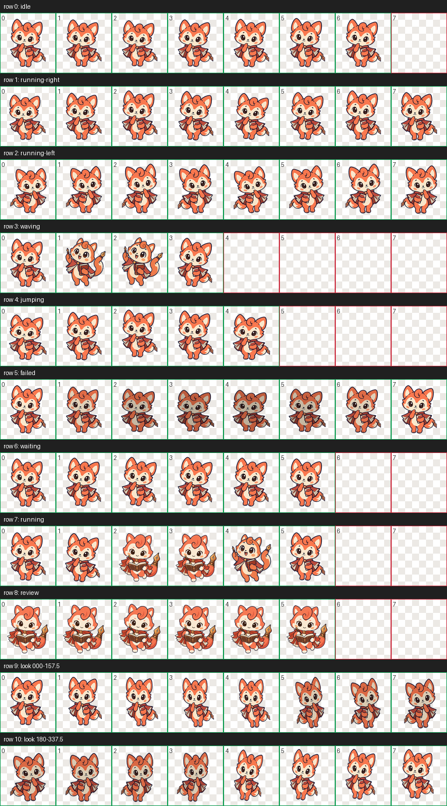

# Claude Coral Scribe（可爱版）v1


Coral Scribe 是一只原创的暖珊瑚色文艺小精灵：她披着书页斗篷，尾巴像一支铜色羽毛笔。工作循环会在托腮、持书写作、举笔灵感三个姿势之间切换，并加入轻微位置变化。

## 安装到 Codex

在仓库根目录运行：

```bash
mkdir -p ~/.codex/pets/claude-cute-v1
cp -R pets/claude/claude-cute-v1/. ~/.codex/pets/claude-cute-v1/
```

然后在 Codex 的“设置 → Mini 与虚拟宠物”中选择“Claude Coral Scribe（可爱版）”。若列表未立即刷新，请重启 Codex。

## 包内容

| 文件 | 用途 |
| --- | --- |
| `preview.png` | GitHub 目录和 README 的角色预览。 |
| `spritesheet-preview.png` | 完整 8×11 动作与方向帧表预览。 |
| `pet.json` | Codex 读取的宠物配置。 |
| `spritesheet.webp` | 可安装的透明 v2 精灵图集，尺寸为 `1536×2288`。 |
| `build/` | 主视觉、独立动作源图和可重复构建图集的脚本。 |
| `build/poses/` | 写作和灵感举笔两个工作姿势源图。 |
| `qa/` | 图集校验、接触表和方向检查产物。 |

## 预览完整帧表



## 实际尺寸工作预览

下面的 GIF 使用 `192×208` 实际单帧尺寸，展示三个源姿势的切换；当前没有逐帧绘制翻页或笔尖移动。


## 重新构建

在仓库根目录运行：

```bash
python3 -m pip install Pillow
python3 pets/claude/claude-cute-v1/build/build_spritesheet.py
```

脚本会输出透明 PNG 中间图、正式 `spritesheet.webp`、角色预览、完整接触表，以及 `qa/` 中的实际尺寸首帧、工作行 PNG 和动画 GIF。WebP 使用无损和 `exact=True` 保存，保持完全透明像素的 RGB 为零。

## 创作与许可

角色主视觉与动作源图以 `gpt-image-2.5-sunburst` 生成，再由本目录 `build/build_spritesheet.py` 编排为 Codex v2 动画帧。设计使用暖橙、奶油白和深蓝轮廓来保证 `192×208` 小尺寸下的识别度。

这是独立的非官方社区创作，不复制 Claude 的官方标志、商标图形或人物形象，也不代表 Anthropic 的合作或认可。素材与代码以仓库的 [MIT License](../../../LICENSE) 发布。
