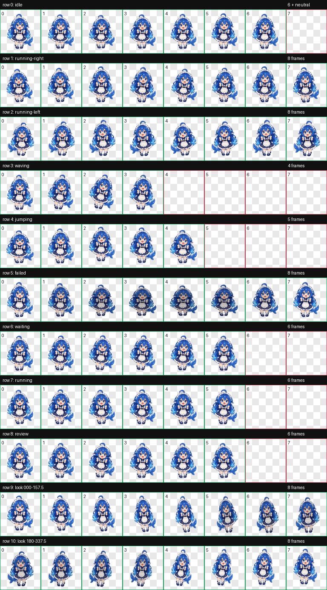

# DeepSeek 大肥鱼（可爱版）v1


蓝发、白色头饰、深蓝白女仆裙和鲸鱼尾巴组成的 Q 版桌面宠物。她会轻轻浮动、眨眼、挥手和摆尾，适合作为活泼的编码陪伴。

## 安装到 Codex

在仓库根目录运行：

```bash
mkdir -p ~/.codex/pets
cp -R pets/deepseek/deepseek-big-fish-cute-v1 ~/.codex/pets/deepseek-big-fish-cute-v1
```

然后在 Codex 的“设置 → Mini 与虚拟宠物”中选择“DeepSeek 大肥鱼（可爱版）”。若列表未立即刷新，请重启 Codex。

## 包内容

| 文件 | 用途 |
| --- | --- |
| `preview.png` | GitHub 目录和 README 的角色预览。 |
| `spritesheet-preview.png` | 完整 8×11 动作与方向帧表的预览。 |
| `pet.json` | Codex 读取的宠物配置。 |
| `spritesheet.webp` | 可安装的透明 v2 精灵图集，尺寸为 `1536×2288`。 |
| `build/` | 源图和可重复构建图集的脚本。 |
| `qa/` | 图集校验结果、动作帧表与方向检查产物。 |

## 预览完整帧表



## 创作与许可

角色主视觉以 `gpt-image-2.5-sunburst` 生成后，再由本目录 `build/build_spritesheet.py` 编排为动画帧。成品图集已通过 Codex v2 尺寸、透明通道、帧位和透明像素残留校验。

本宠物是独立的非官方社区创作，与 DeepSeek 无隶属或合作关系。素材与代码以仓库的 [MIT License](../../../LICENSE) 发布。
