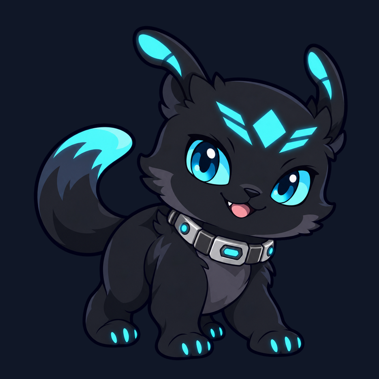
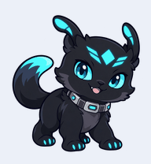
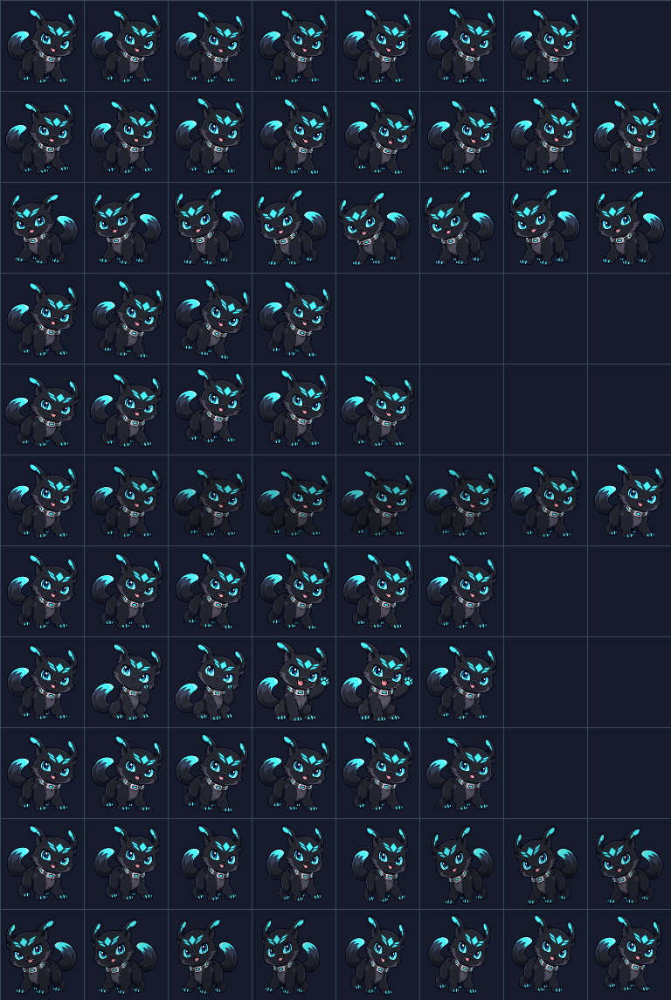

# Grok 宇宙小坏蛋（可爱版）v1



一只原创的深灰色宇宙 AI 小伙伴：大大的霓虹青眼睛、几何光纹、银灰工具项圈和弯曲的彗星尾巴。轮廓和配色为 `192×208` 宠物尺寸优化，工作时会从平静坐姿切换到“爪托脸思考 → 得意举爪 → 回到坐姿”，采用两张独立绘制的真实肢体动作图。

## 安装到 Codex

在仓库根目录运行：

```bash
mkdir -p ~/.codex/pets/grok-cute-v1
cp -R pets/grok/grok-cute-v1/. ~/.codex/pets/grok-cute-v1/
```

然后在 Codex 的“设置 → Mini 与虚拟宠物”中选择“Grok 宇宙小坏蛋（可爱版）”。若列表未立即刷新，请重启 Codex。

## 包内容

| 文件 | 用途 |
| --- | --- |
| `preview.png` | 角色预览图。 |
| `spritesheet-preview.png` | 完整 8×11 动作与方向帧表预览。 |
| `pet.json` | Codex 宠物配置，声明 v2 图集。 |
| `spritesheet.webp` | 可安装的透明 v2 精灵图集，尺寸为 `1536×2288`。 |
| `build/` | 透明主视觉与可重复构建脚本。 |
| `build/poses/` | 以同一主视觉为参考生成的托脸思考和得意举爪姿势。 |
| `qa/` | 图集校验和检查产物。 |
| `qa/working-192.png` | 六帧工作循环，按实际 `192×208` 单帧尺寸排列。 |
| `qa/working-192.gif` | 按 Codex 工作状态时长播放的动作预览。 |

## 工作动作



从仓库根目录运行：

```bash
python3 -m pip install Pillow
python3 pets/grok/grok-cute-v1/build/build_spritesheet.py
```

即可重新导出正式 WebP 图集、角色预览、完整帧表预览与工作动作预览。WebP 使用无损编码并保留全透明像素的零 RGB 值。

## 预览完整帧表



## 创作与许可

主视觉与独立动作姿势由 `gpt-image-2.5-sunburst` 生成，动作姿势使用主视觉作为图像编辑参考，再由 `build/build_spritesheet.py` 编排为动画帧。本角色为独立的非官方社区创作，不复制 Grok 的官方标志、文字或吉祥物，不代表任何官方合作或认可。素材与代码以仓库的 [MIT License](../../../LICENSE) 发布。
