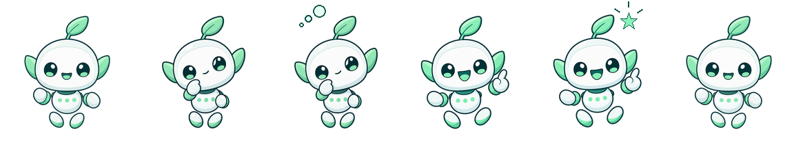

# OpenAI 绿芽助手（可爱版）v1


这是一个原创的薄荷绿 AI 小助手形象：白色圆脸、叶片天线、薄荷绿耳鳍和漂浮小脚。它为 `192×208` 桌面宠物尺寸设计，轮廓和眼睛在缩小后仍然清晰。工作状态使用独立姿势绘图，演绎“手贴脸思考 → 思考泡泡 → 举起食指、开心踢脚 → 灵感星星”。



## 安装到 Codex

在仓库根目录运行：

```bash
mkdir -p ~/.codex/pets/openai-cute-v1
cp -R pets/openai/openai-cute-v1/. ~/.codex/pets/openai-cute-v1/
```

然后在 Codex 的“设置 → Mini 与虚拟宠物”中选择“OpenAI 绿芽助手（可爱版）”。若列表未立即刷新，请重启 Codex。

## 包内容

| 文件 | 用途 |
| --- | --- |
| `preview.png` | GitHub 目录和 README 的角色预览。 |
| `spritesheet-preview.png` | 完整 8×11 动作与方向帧表预览。 |
| `pet.json` | Codex 读取的宠物配置。 |
| `spritesheet.webp` | 可安装的透明 v2 精灵图集，尺寸为 `1536×2288`。 |
| `build/source.png` | 透明主视觉源图。 |
| `build/poses/` | 保持角色身份的托脸思考和举手灵感两张独立姿势源图。 |
| `build/build_spritesheet.py` | 可重复构建图集的脚本。 |
| `qa/` | 图集校验、接触表和小尺寸检查产物。 |

## 重建素材

安装 Python 的 Pillow 依赖后，从仓库根目录运行：

```bash
python3 -m pip install Pillow
python3 pets/openai/openai-cute-v1/build/build_spritesheet.py
```

一次运行会生成透明 PNG 图集、以 `lossless=True` 和 `exact=True` 编码的 WebP 图集、角色预览、完整帧表以及 `qa/work-row-192.png`。精确透明编码保留透明像素的零 RGB，避免残留。

## 设计与许可

主视觉使用 Lumivia 的 `gpt-image-2.5-sunburst` 生成；托脸和举手姿势以同一主视觉为编辑输入生成，再由本目录脚本编排为 Codex v2 动画帧。形象是独立的社区原创创作，不复制 OpenAI 的官方标志、商标图形或产品界面，也不代表 OpenAI 官方合作或认可。素材与代码以仓库的 [MIT License](../../../LICENSE) 发布。
